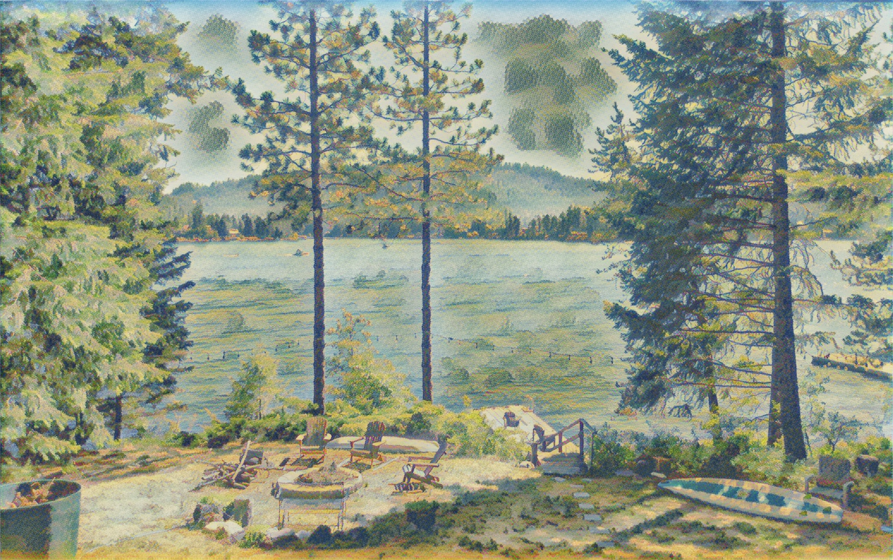
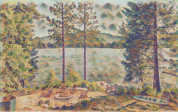
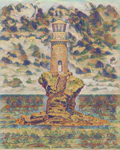
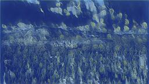
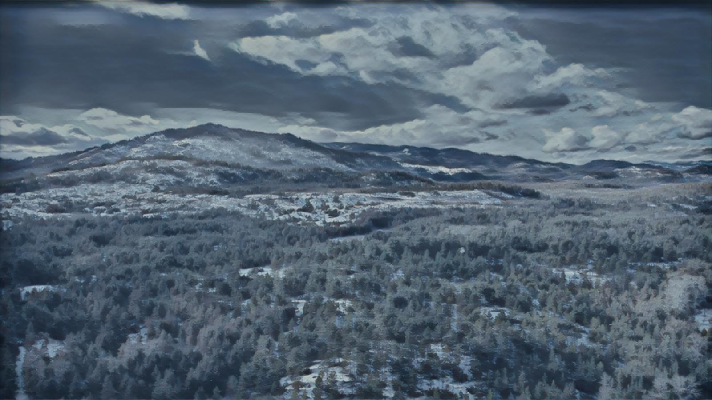
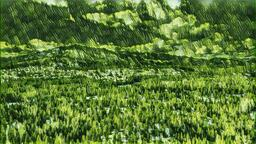
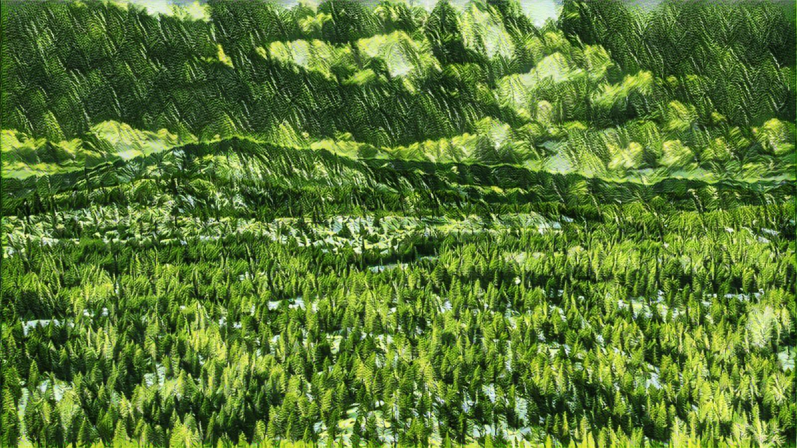
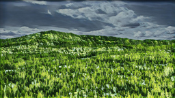

---
title: gallery
x-toc-enable: false
...

neural style transfer
=========================================

Here are some images made with neural style transfer. I wrote a simple python
script called [unstop](https://github.com/duncanldaho/unstop) that applies the
style from one image onto another. You can read more about how the python script
works [here](/nst.html).

These images are just a sample, please ignore the awkward grid. I am still
looking into the best way of generating and organizing this page.

----

 

 

 

 

