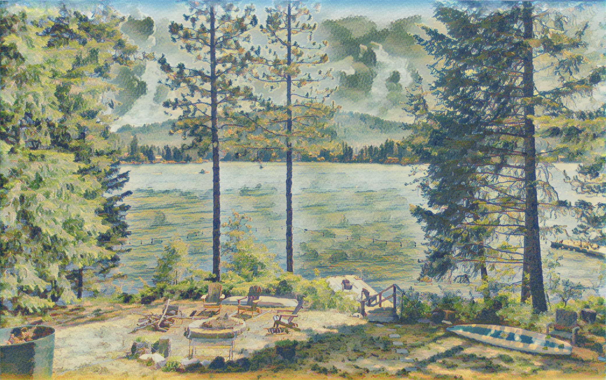
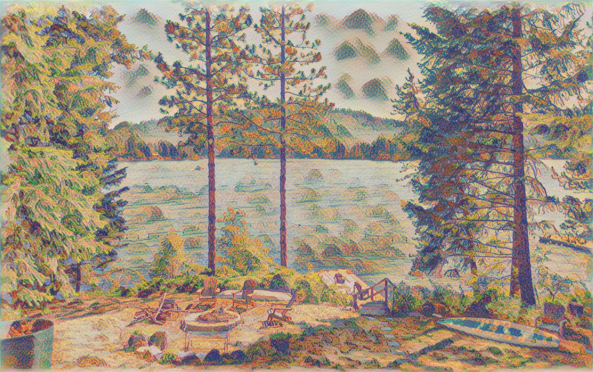
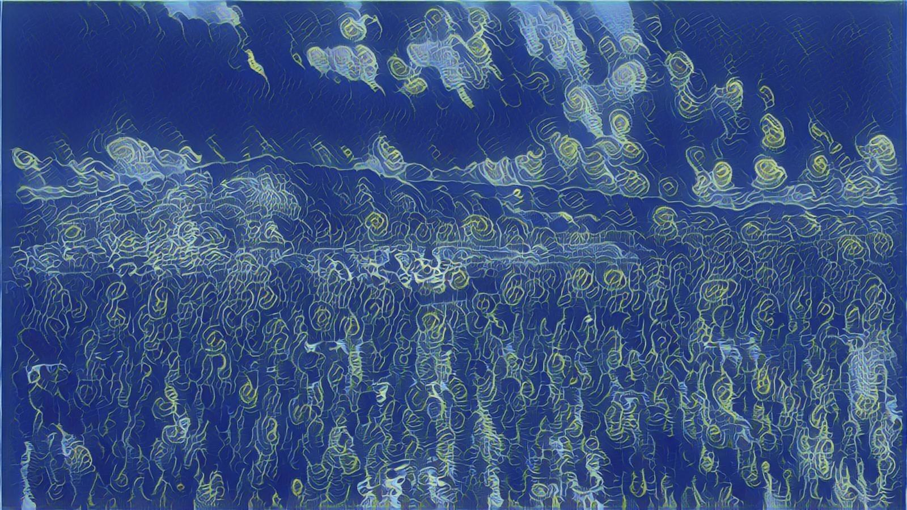
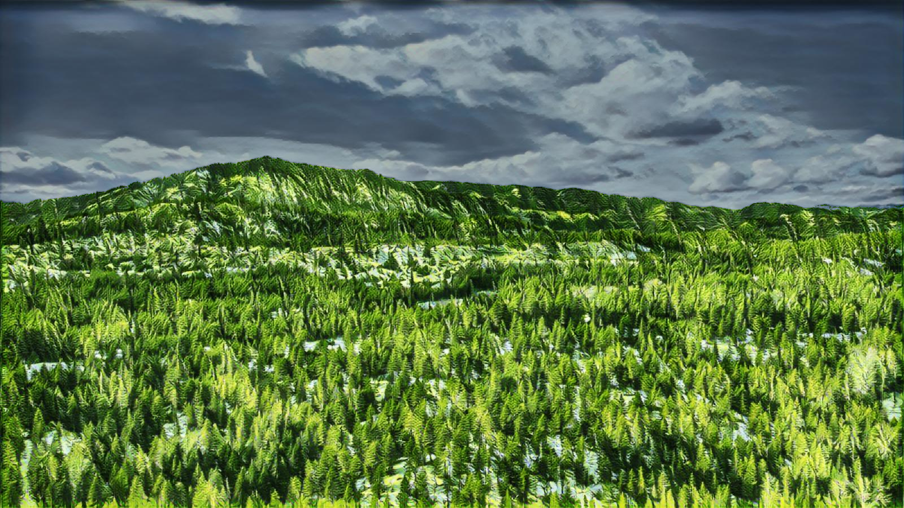

---
title: gallery
x-toc-enable: false
...

neural style transfer
=========================================

I threw together a python script to peform neural style transfer using a pretrained tensorflow [model](https://tfhub.dev/google/magenta/a%20rbitrary-image-stylization-v1-256/2). I still need to find the best way to implement a lightbox or gallery into this website, ignore the awkward grid until I do. The source code is available on [github](https://github.com/duncanldaho/unstop) for now.

